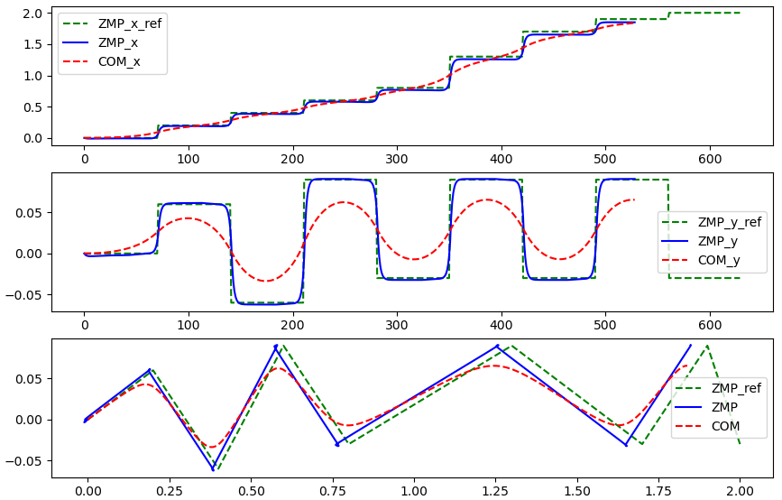

# ZMP Preview Control

This is the Python implementation of ZMP Preview Control approach for biped robot control.

Required Python 3.6+, and use the following commands to install reqired packages:

```python
pip install numpy, control, matplotlib
```


代码配备了中文博客，详见：[双足机器人ZMP预观控制算法介绍及代码实现](https://zhuanlan.zhihu.com/p/452704228?)


## Basic ZMP preview control approach

Reference paper:

1. [Kajita, Shuuji, et al. "Biped walking pattern generation by using preview control of zero-moment point" in 2003 IEEE International Conference on Robotics and Automation (Cat. No. 03CH37422). Vol. 2. IEEE, 2003.](https://ieeexplore.ieee.org/iel5/8794/27834/01241826.pdf)
2. Book：”Introduction to Humanoid Robotics” by Kajita, Shuuji. 中文译名为《仿人机器人》，可关注公众号后，在后台回复【HR】获取书籍的下载链接。


## Improved ZMP preview control approach

Reference paper:

1. [Jonghoon Park, Youngil Youm, “General ZMP Preview Control for Bipedal Walking” in Proceedings 2007 IEEE International Conference on Robotics and Automation.](https://ieeexplore.ieee.org/document/4209488/authors#authors)


## Experiments

### Basic ZMP preview control




### Improved ZMP preview control


